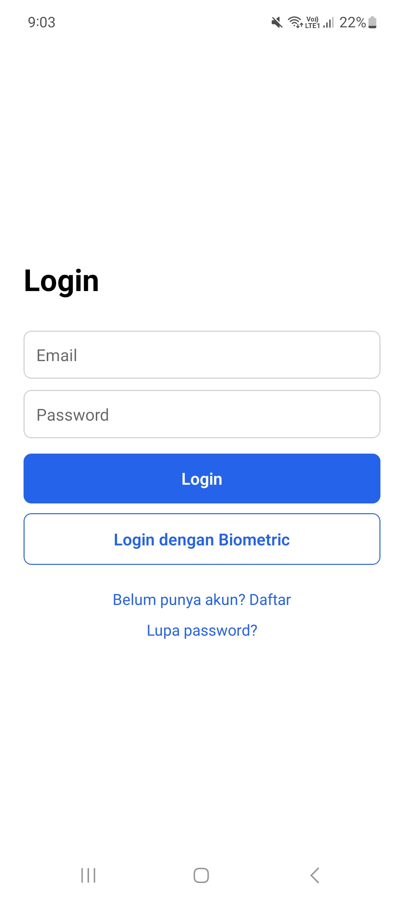
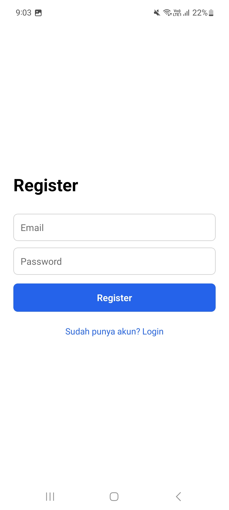
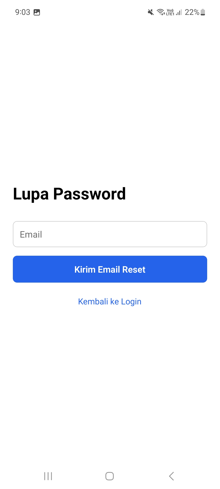
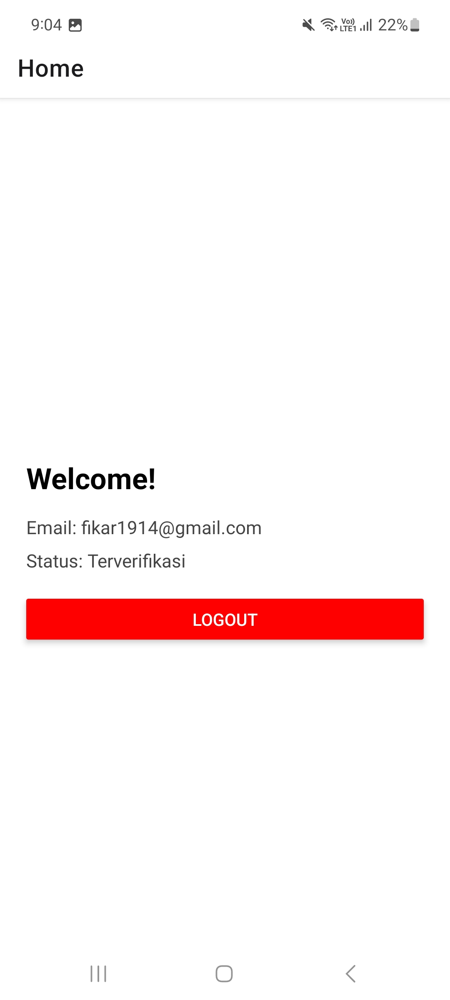

# Auth-Praktikum

## Informasi Mahasiswa
- **Nama** : Zulfikar Hasan  
- **NIM** : 2410501016  
- **Kelas** : B  

---

## Deskripsi
Aplikasi auth sederhana yang mengimplementasikan sistem autentikasi dan otorisasi lengkap. Aplikasi ini mencakup login email/password, 
biometric authentication, protected routes, password reset, email verification, dan auto-logout setelah idle.

---

 ## Dependencies utama :

- firebase
- @react-native-async-storage/async-storage
- expo-secure-store
- expo-local-authentication
- react-native-safe-area-context

---

## Fitur yang dikemabngakan
- Login & Register dengan Email/Password (Firebase Authentication)
- Email Verification setelah Register
- Password Reset via Email
- Biometric Authentication sebagai pengganti password pada login berikutnya
- JWT Token disimpan aman menggunakan expo-secure-store
- **Auto-logout setelah 5 menit idle (menggunakan AppState + setTimeout)**


---

## Screenshot Preview

<p>
  
  
  
  
</p>

## Video Demo
Link demo aplikasi yotube:
[Klik untuk menonton video demo Youtube](youtube.com)

---

## Cara Menjalankan

Aplikasi ini menggunakan **Expo**.

### 1. Clone Repository
```bash
git clone <URL_REPOSITORY>
```

### 2. Masuk Ke Folder Project
```bash
cd ResepKita
```

### 3. Install Dependencies
```bash
npm install
```

### 4. Jalankan Aplikasi
```bash
npx expo start
```
